# Updates with Rover
## Projects detail (continuing from previous EGG-499)
* Department : UNLV Electrical and Computer Engineering  
* Place : SEB #3229  
* Duration : 01/16/24 ~ 01/24/24  
* Updates : structures, inside, system setup  

   

# Hardware
## Structure
### Design 3D modeling
* with Blender
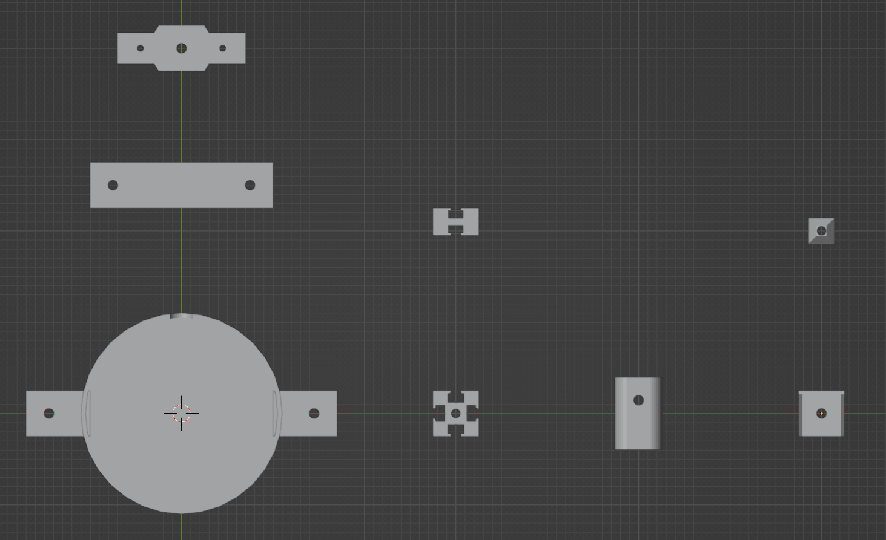 
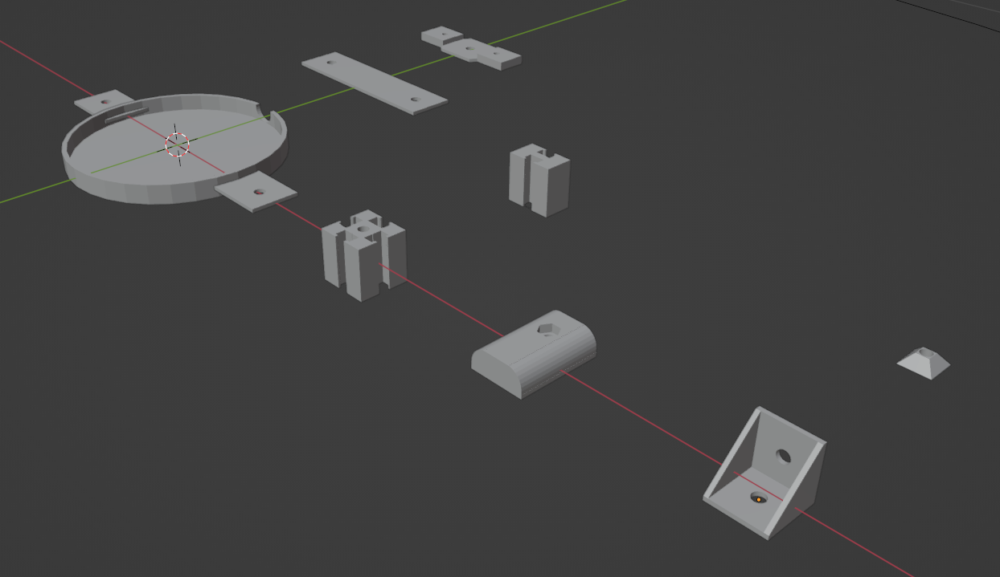 

 

### Print
* with Flsun superracer
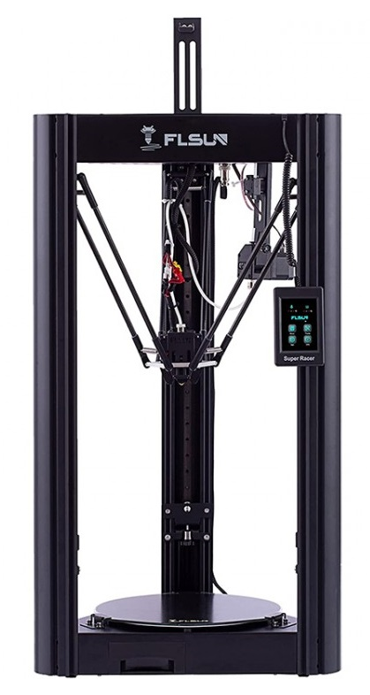 

 

### Assemble
* Lidar plate and stand  
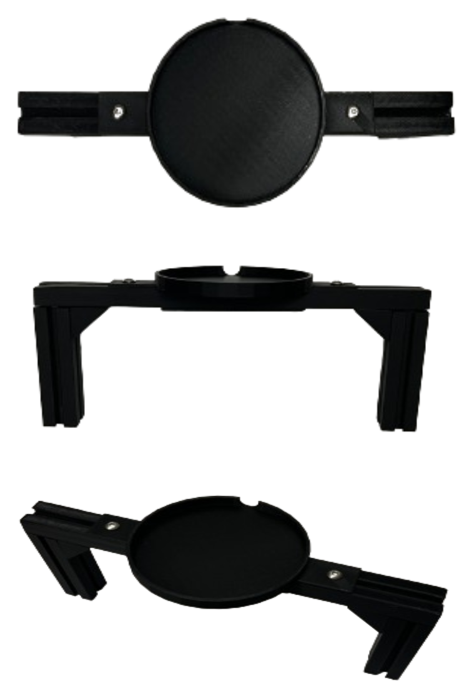

* Camera holder

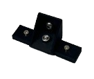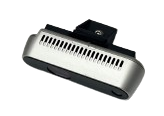

* Inner plate and stand

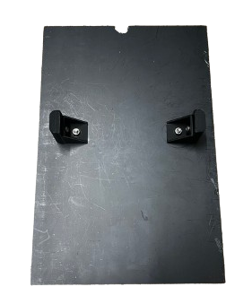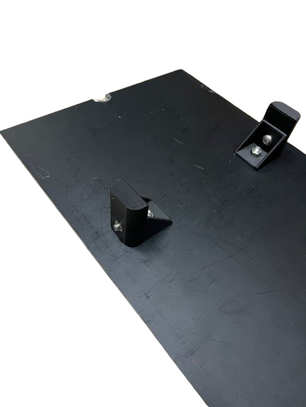 

   

## Inside
* wiring and placing stuffs

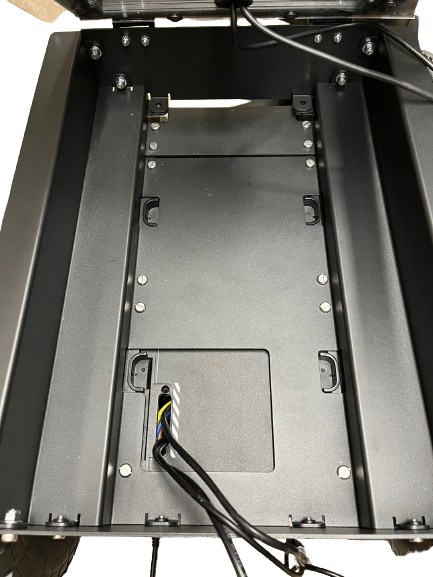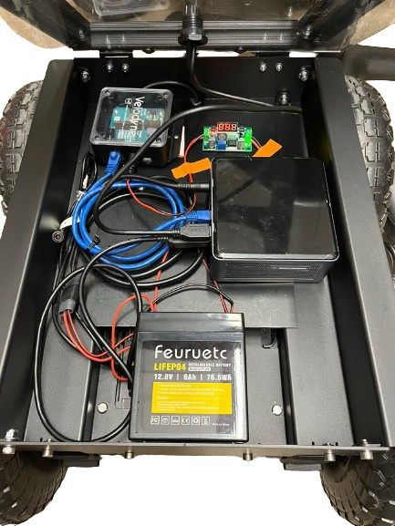

   

# Software
## Main system files
* /etc/systemd/system/roverrobotics.service  
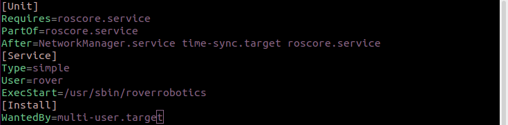

* /usr/sbin/roverrobotics  
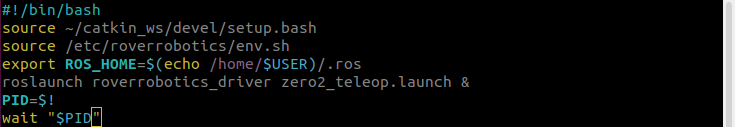

* /etc/roverrobotics/env.sh  
  

   

## Main workspaces function
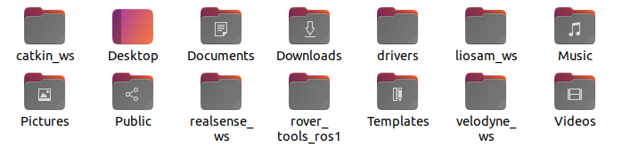  

* catkin_ws : rover driver   
* realsense_ws : camera and imu transform   
* velodyne_ws : pointcloud   
* liosam_ws : mapping   

   

## IP setup for ssh
* /etc/roverrobotics/env.sh 
* ~/.bashrc

   

## Velocity setup
* roverrobotics_ros_driver.cpp  
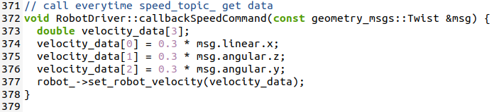  

   

# Results
## Looks
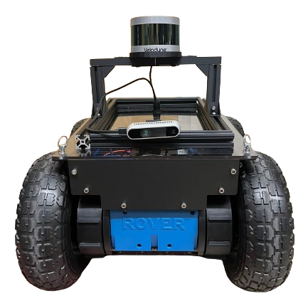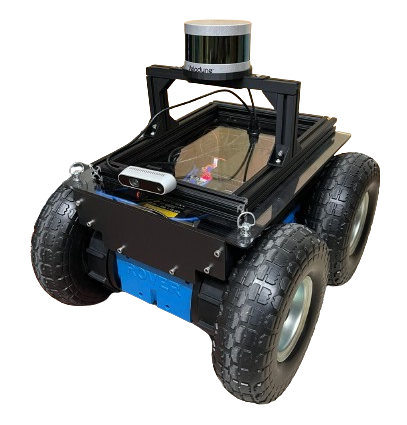  
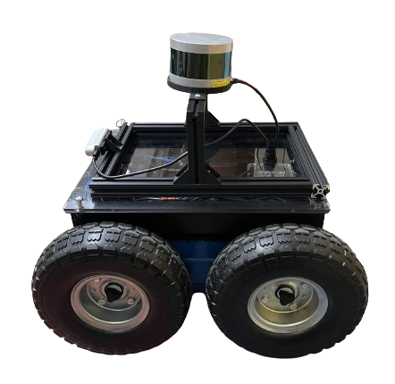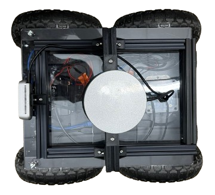  

   

## Test
[Test Vid](https://youtu.be/PPUc6Rkc0Pk)  

   

## Map result
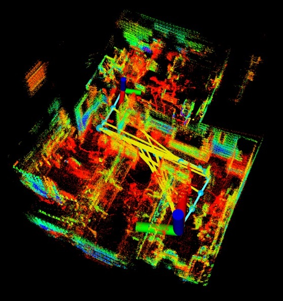

   

## Discussion
During this project, I studied ROS thoroughly and gained a comprehensive understanding of both the hardware and software components of robots. By utilizing camera and implementing depth cloud processing, I was able to identify gaps in the environment and perceive the surroundings more accurately. Also, integrating a rover with LIDAR, I successfully obtained 3D data and created detailed maps of the environment. Although I couldn't implement a navigation function in this particular project, I successfully achieved it in a previous project, Mobile Robotics.

   
